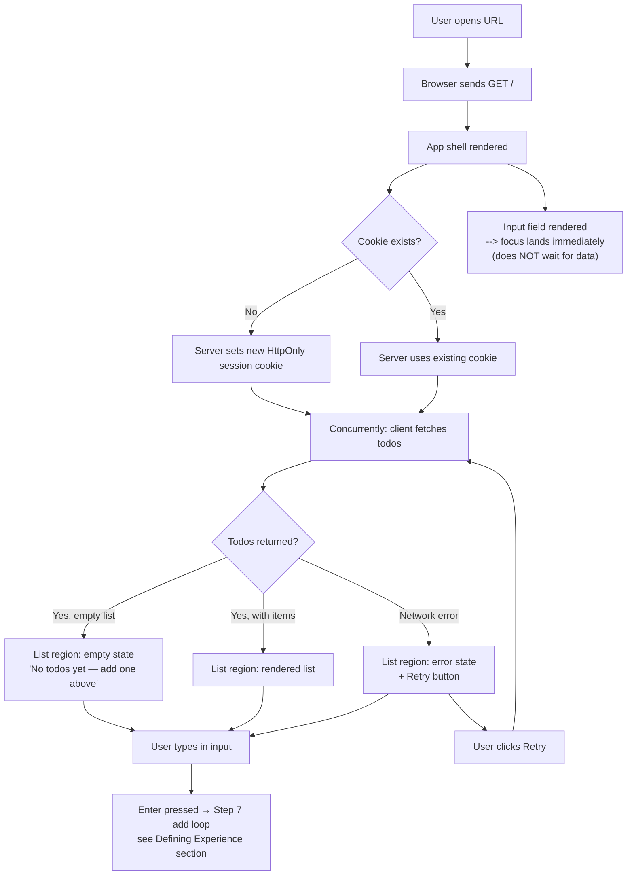
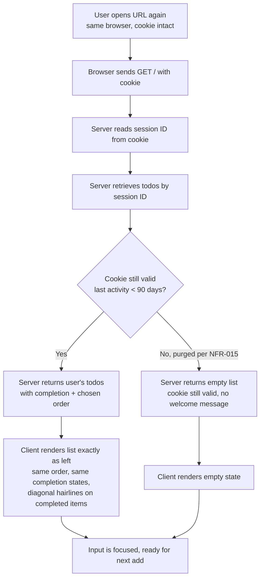
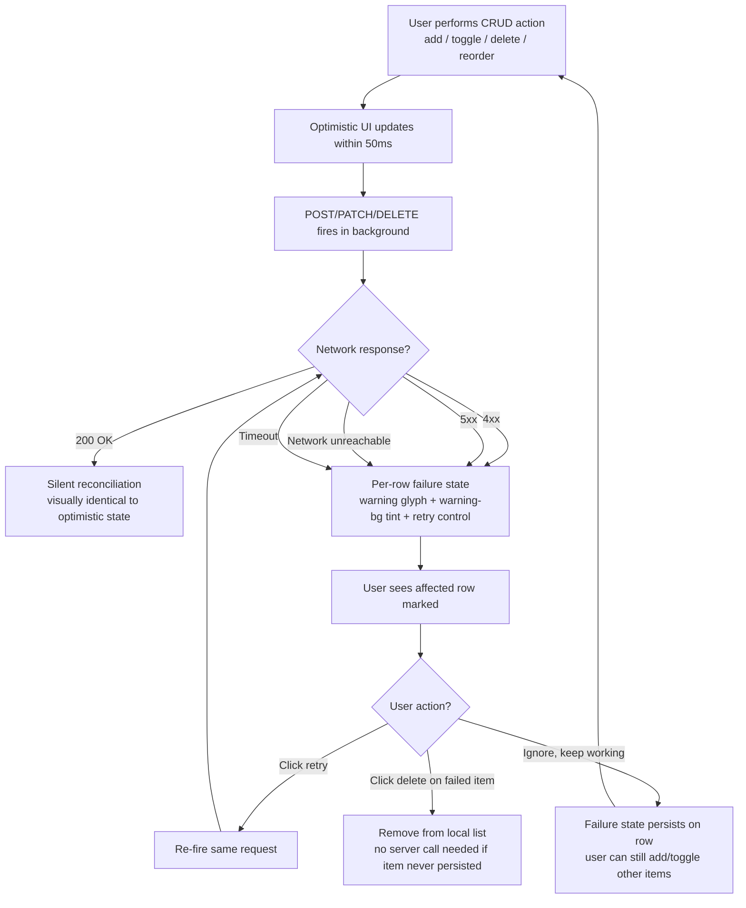
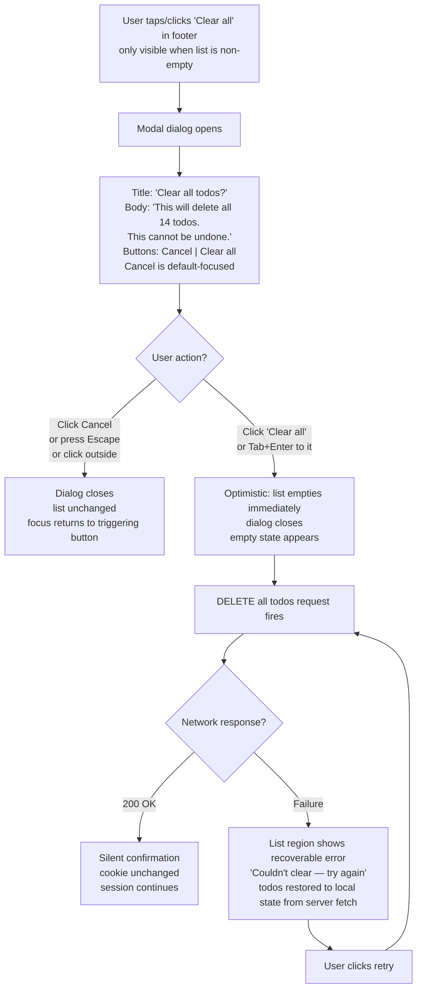

# UX Design Specification todo-bmad

**Author:** Guntter
**Date:** 2026-05-01

---

## Executive Summary

### Project Vision

`todo-bmad` is a deliberately minimal full-stack todo SPA whose UX bar is set by two non-negotiable differentiators:

1. **Zero-friction interaction.** Open → see → act → done. The list is visible immediately on load; add, complete, delete, and reorder are reflected in the UI within 100 ms; no spinner ever appears for a normal CRUD action. Optimistic UI with non-blocking rollback is the user-experience contract.
2. **Genuine responsive design.** The interface is intentional and pleasant on every viewport from 320 px to 1920 px. The mobile layout is canonical; desktop adds whitespace rather than complexity. Layout, type sizing, touch targets, and spacing are designed *per breakpoint range*, not auto-scaled.

The underlying design philosophy: *a todo app's value is not features — it's friction.* The UX must aggressively defend the smallest possible scope and let restraint be the brand.

The product is the medium; the BMAD methodology demonstration is the message — meaning the UX must look and feel like a real, finished product so the methodology is credible, not a wireframe wearing CSS.

### Target Users

**Persona 1 — Lina, the anonymous visitor (primary).** A mainstream internet user arriving at the deployed URL with no account, no patience for setup, and no tutorial. Tech-comfortable but not technical. Uses both phone and desktop as equal first-class devices. Encountered in four canonical contexts (all from PRD journeys):

- *First visit:* must complete all four CRUD actions unaided in under 30 seconds.
- *Returning next day:* expects her list to "just be there" — no log-in, no recovery flow.
- *Flaky network (train):* expects optimistic UI to feel forgiving, with non-blocking inline failure indication and easy retry — never a modal, never a crash.
- *Clean slate:* expects a discoverable but non-intrusive Clear-all action, with destructive-action confirmation that defaults focus to Cancel.

**Persona 2 — Marco, the reviewer (secondary, but UX-relevant).** A senior engineer with ~15 minutes who runs Lina's happy path himself before auditing the artifact chain. For UX purposes, he is a skeptical first-time-visitor heuristic evaluator: the interface must survive a cold, critical 30-second run-through with no friction.

**Implicit user-context decisions carried into UX:**

- Problem solved: capture and discharge small obligations, with zero ceremony.
- "Exactly what I needed" moment: opened it, typed, it just worked, and it was still there the next day.
- Tech-savvy: mainstream web user, no power-user assumptions, no onboarding, no help affordance.
- Devices: phone and desktop are equally important; tablet is supported but not specially designed.
- Network: usable on flaky connections, including offline-recovery feel (without being a PWA in v1).

### Key Design Challenges

1. **Polish overshoot risk.** Time spent on animations, illustrations, or micro-interactions that don't move the two named differentiators is explicitly called out as a project risk. The UX spec must be opinionated about restraint — every visual decision serves zero-friction or genuine-responsive, or is cut.
2. **Optimistic-UI failure communication.** Per-item rollback with non-blocking inline indication and inline retry — while keeping the list calm and non-jarring — is the single hardest UX surface. Modal error dialogs are forbidden by the differentiator contract.
3. **Accessible drag-and-drop reorder.** Pointer drag is straightforward; keyboard semantics on the drag handle (focus → Space/Enter pickup → arrow keys to move → Space/Enter drop) are the part most apps get wrong. The handle affordance and "being moved" state must work at every breakpoint, including 320 px.
4. **Honest responsive design at the extremes.** Layouts that look fine at 375 px and 1440 px frequently break at 320 px and 1920 px. Explicit layout decisions are required at the edges, not assumed by scaling.
5. **Four list-region states without modal interruptions.** Empty, cold-start loading, backend-unreachable error, and per-item failure must all live in the same list region without jarring transitions, while optimistic-UI inserts and removals are also reshaping content.
6. **Zero-cognitive-overhead first visit.** Lina must complete all four CRUD actions unaided in under 30 seconds. Affordances must be self-evident — no onboarding, no tooltips, no help icon.

### Design Opportunities

1. **The input field as the protagonist.** Auto-focused on load, the first interaction surface, and the visual anchor of the page. Designing it as the canonical primary surface — not a form widget tucked above a list — is a high-leverage decision that pays off at every breakpoint.
2. **Optimistic UI as visible confidence.** Use the immediacy of insert / strikethrough / removal as the *proof* the app is fast. Where most apps hide optimistic UI behind a "just-in-case" spinner, this app lets the speed *be* the experience.
3. **The list is the entire UI.** No nav bar, no sidebar, no settings panel. List + input + small footer is the whole product. The visual minimalism is the brand.
4. **Per-item failure indication as a first-class component.** Designing the failed-item state as a deliberate inline pattern (e.g., quiet warning glyph + inline retry on the affected row) turns the riskiest UX surface into a quiet differentiator on flaky networks.
5. **Mobile-first as a real design decision.** The mobile layout is canonical; desktop adds intentional whitespace, not extra features. Desktop feels calm and considered rather than under-utilized — a quality cue that supports the methodology-demo framing.

## Core User Experience

### Defining Experience

The product has exactly one core action: **type a thing into the input and press Enter.** Every other capability (toggle, delete, reorder, clear-all) is secondary and inherits the same interaction contract. If the input-and-add loop is perfect, the product feels right; if it's wrong, no other polish recovers it.

The canonical loop:

1. The input field is focused on load (FR-009), with a clear placeholder.
2. Enter submits; an Add button is present for discoverability and accessibility but is visually secondary.
3. The new todo appears at the top of the list instantly (FR-003, FR-016) — no spinner, no flash, no layout jump.
4. The input clears and remains focused, ready for the next entry. Repeated capture is the canonical use.
5. Validation failures (empty, > 1024 chars) surface inline near the input, non-blocking, and never steal focus.

Secondary actions (toggle / delete / reorder / clear-all) all act on the list itself and inherit the same "instant, no spinner, no modal" contract.

### Platform Strategy

- **Single-page web app, browser only.** No native app, no PWA, no offline service worker in v1.
- **One route, one view.** No client-side routing. The URL is the URL; no sub-pages.
- **Touch and pointer are equal first-class inputs.** Designed for both, not "designed for desktop, also works on touch."
- **Keyboard is a first-class input.** Required for accessibility (NFR-016) and is the canonical add path (Enter).
- **Online-required.** Backend persistence is the source of truth; cookie-scoped session is the only identity. The flaky-network journey is handled gracefully via optimistic UI + rollback, but the app does not function offline.
- **HTTPS-only deployed origin** (NFR-008); single domain; OG/Twitter card meta required for shareability (FR-025).

### Effortless Interactions

These are the interactions where zero perceptible work is the bar. Each is non-negotiable because each is exposed in the differentiator contract or in a PRD journey.

| Interaction | "Effortless" means |
|---|---|
| **Open the page** | List visible within ~800 ms warm cache, ~1.5 s cold (NFR-001/002). No splash screen, no loading wall. |
| **Add a todo** | Focused input on load → type → Enter → new item appears at the top with no perceptible delay. Input clears and refocuses for the next add. |
| **Toggle a todo** | One click/tap on the checkbox → instant strikethrough/dim. No re-render flicker, no list reorder. |
| **Delete a todo** | One click/tap on the per-item delete control → instant removal from the list. No "are you sure?" for single deletes (single delete is cheap to recreate; modal would violate the friction contract). |
| **Reorder by pointer** | Touch/click on a clear handle, drag, drop. Visual feedback throughout the drag. The drop position is obvious before release. |
| **Reorder by keyboard** | Tab to handle → Space/Enter to pick up → ↑/↓ moves the item visibly one slot at a time → Space/Enter to drop. Visible "lifted" state and an `aria-live` announcement on each move. |
| **Returning the next day** | Same URL, same browser → list is just there. No login, no recovery prompt, no "welcome back." |
| **A failed save** | The affected item visibly marks itself as "couldn't save" inline (small glyph, color shift), with an inline retry control. The list does not reorder. No modal. No global toast that vanishes before the user can read it. |

### Critical Success Moments

The moments that determine whether the product earns trust or loses it. Each must be designed for explicitly:

1. **First paint of the list.** The visitor's first half-second on the page. If the list region shows a spinner here for any noticeable time, the differentiator is dead. A clean empty state plus a focused input means the user is already "in" the loop without thinking.
2. **First add.** The first Enter-press in this user's lifetime. The instant insertion is the moment they conclude the app is fast and good. Slowness or a layout jump here is unrecoverable.
3. **First toggle.** The first "I did this thing" reward. The strikethrough/dim is the payoff. Slow or sloppy here kills the loop.
4. **Closing the tab and coming back tomorrow.** Pure persistence trust. Anything missing, reordered, or "almost right" causes a permanent conclusion that the app is unreliable.
5. **First save failure.** The flaky-network moment. The user must (a) see which item failed, (b) understand it's not the whole app's fault, and (c) retry without re-typing. A modal here, a vanished item, or "Something went wrong" with no actionable recovery collapses the trust contract.
6. **First Clear-all confirmation.** Destructive action. Cancel default-focused. Plain consequence statement ("This will delete all 14 todos. This cannot be undone."). The action feels deliberate, never accidental (FR-015).

### Experience Principles

The design oath. Every later UX decision is checked against these. Anything that doesn't honor at least one is cut.

1. **Speed is the feature.** Optimistic-UI immediacy isn't a technique — it's the product's primary value claim. No spinner, no perceptible delay, no full-screen loading state on any normal action. *Latency is design debt.*
2. **The list is the UI.** No nav, no sidebar, no settings page, no help icon, no onboarding. Input + list + small footer. Anything competing with the list for visual attention loses.
3. **Restraint is the brand.** Every visual element earns its place by serving zero-friction or genuine-responsive. Decorative animations, illustrations, icons, colors, and "delight" micro-interactions are cut by default.
4. **Mobile is canonical, desktop is generous.** Mobile is the design; desktop adds whitespace and breathing room, not extra content or extra controls. Desktop should feel calm and intentional, never empty or under-utilized.
5. **Failure is inline, never modal.** Save failures, network errors, and validation problems surface in-place, non-blocking, with a clear recovery path. The only modal in v1 is the destructive Clear-all confirmation.
6. **Affordances are self-evident.** No tooltips, no help text, no "?" icons. If a control needs an explanation in v1, it's the wrong control. The Lina test (all four CRUD actions completed unaided in under 30 seconds) is the bar.
7. **Keyboard parity is a feature, not an audit checkbox.** Every interaction (including reorder) is fully operable from the keyboard with discoverable, conventional semantics. Serves accessibility and power-users in the same design.
8. **Same product on every screen.** All primary capabilities are present and equally usable at 320 px and at 1920 px. Capability does not collapse on small screens; decoration does not bloat on large ones.

## Desired Emotional Response

### Primary Emotional Goals

The product should make users feel:

1. **Trusted and unbothered.** "It works. It remembers. I don't have to think about it." This is the dominant feeling and the emotional through-line of the entire experience — the emotional version of the "speed is the feature" principle.
2. **In control without effort.** Every action lands exactly where the user expected it to, the moment they did it. No surprise reorderings, no "did that save?", no double-checking. This is the emotional version of optimistic UI: the app should feel like an extension of user intent.
3. **Treated as adults, not as users.** No tutorials, no celebratory toasts, no progress bars labeled "you're doing great!", no Easter eggs. The message is: *we respect your time and your intelligence enough not to perform for you.*

These are deliberately quiet emotions. The product is **not** trying to make users feel delighted, surprised, excited, or accomplished. Excitement on a todo app is a design smell — it suggests the app is competing with the work it's supposed to support.

### Emotional Journey Mapping

| Moment | Desired feeling | Anti-feeling (must prevent) |
|---|---|---|
| **Page open (cold)** | Quiet readiness — "okay, here we go" | Anxiety, waiting, "is this working?", staring at a spinner |
| **First add** | Confirmation — "yep, that's what I meant" | Surprise, hesitation, "did it take it?" |
| **First toggle complete** | Quiet satisfaction — a small, private "done" | Performative celebration, fireworks, confetti, "Great job!" |
| **First delete** | Decisiveness — "gone, fine" | Regret, "wait, was there a confirm?", "did I mean to do that?" |
| **First reorder (pointer)** | Tactility — "I picked it up and put it down" | Floatiness, snapping, items jumping unpredictably |
| **First reorder (keyboard)** | Mechanical confidence — "I'm in control of this" | Clumsiness, "I lost track of where the item is" |
| **Returning the next day** | Reassurance — "yes, of course it's still here" | Surprise, gratitude — persistence should be expected, not impressive |
| **Network failure** | Calm — "okay, that didn't save, I can retry" | Panic, alarm, "did I lose data?" |
| **Validation error** | Mild correction — "got it, my bad" | Embarrassment, scolding, modal-with-OK-button feeling |
| **Clear-all confirmation** | Deliberate gravity — "yes, I really mean this" | Casual click-through, accidental destruction |
| **Clear-all done** | Clean slate — quiet satisfaction | Loss, emptiness, "did I just do something wrong?" |
| **Reviewer evaluation** | Restraint and competence — "this is finished, not in-progress" | Wireframe energy, "looks like a tutorial app", under-considered design |

Two patterns of note:

- The "returning the next day" moment intentionally targets *expectation*, not *gratitude*. Gratitude would mean we'd accidentally framed persistence as a perk rather than a baseline.
- Failure moments (network, validation) should feel emotionally **flat**, not negative. The non-modal failure design refuses to manufacture drama out of a transient error.

### Micro-Emotions

| Axis | We want | We avoid | Why |
|---|---|---|---|
| Confidence vs. confusion | Confidence | Confusion | Lina test: 4 CRUD actions unaided in 30 sec. |
| Trust vs. skepticism | Trust | Skepticism | Persistence + reviewer audit both depend on it. |
| Calm vs. anxiety | Calm | Anxiety | Optimistic UI + non-modal failures exist to prevent anxiety. |
| Satisfaction vs. delight | Satisfaction | Delight | Delight is loud; satisfaction is quiet. We want quiet. |
| Accomplishment vs. frustration | Accomplishment (downplayed) | Frustration *and* over-celebration | Completing a todo is the user's accomplishment, not the app's. |
| Respect vs. condescension | Respect | Condescension | No tooltips, no "you're doing great", no help icons. |
| Permanence vs. precariousness | Permanence | Precariousness | The list must feel solid, not fragile. |
| Fluidity vs. stiffness | Fluidity in interaction | Stiffness in interaction | Drag/drop and optimistic insert must feel kinetic, not janky. |
| Restraint vs. flourish | Restraint in visuals | Flourish in visuals | "Restraint is the brand." Visual flourish contradicts the product claim. |
| Excitement vs. excitement-free | Excitement-free | Excitement | Todo apps shouldn't be exciting. They should be ready. |

Headline pairing: **calm + permanent + respectful**. If a single design choice violates any of those three, it's wrong.

### Design Implications

Direct mapping of emotional goals to design constraints to be enforced through the rest of the spec:

| Emotion to evoke | UX/design implication |
|---|---|
| Trusted, unbothered | No spinners on normal CRUD. Optimistic UI everywhere. List appears on load, doesn't animate in. No "syncing…" indicators. |
| In control without effort | Affordances exactly where the user's hand/cursor is going. Tap targets ≥ 44 px on mobile. No motion in places the user didn't act (toasts appearing far from the action are forbidden). |
| Treated as adults | No onboarding. No tooltips. No achievement celebrations. No "Welcome back!". No emoji confetti. Plain language in every string. |
| Calm during failure | Inline failure indication: subtle glyph + color shift on the affected row. Never a full-width banner, never a modal. Use a single muted warning color (amber/ochre, not red). Failure does not steal focus. |
| Quiet satisfaction on completion | Strikethrough + subtle dim on completed items, **plus a single signature completion mark on the card (a thin static diagonal hairline drawn across the row, evoking a notebook strikethrough). Static — no animation, no sound.** The visual change is the reward; the diagonal hairline gives the product a single recognizable visual signature without breaking the no-celebration rule. |
| Permanence | List items have weight: defined card treatment with **subtle dimensionality (a fine border or barely-perceptible shadow — tactile, not glossy; no sheen, no highlight gradient, no glass effect)**, consistent height, single static elevation level. Items do not lift on hover or depress on click; the only direct-manipulation lift is during drag (per Principle 6). On mobile, dimensionality is conveyed by a 1 px border + tiny inset rather than a drop shadow. No skeleton loaders that "morph" into real content. No optimistic items that visibly "settle" after server confirmation — the optimistic state and the confirmed state look identical. |
| Fluidity in interaction | Motion only on direct-manipulation interactions. Drag/drop has continuous visual following; reorder has a brief settling motion (~150 ms). No motion on data appearance, only on user-direct manipulation. |
| Visual restraint | Constrained palette (2 neutrals + 1 accent + 1 warning). Single typeface. Limited type scale (3–4 sizes). No illustrations, no decorative icons, no background gradients. |
| Self-evident affordances | Conventional controls used conventionally. A checkbox looks like a checkbox. A delete control looks like a delete control. The drag handle looks like a drag handle. |
| Keyboard parity | Visible focus state on every interactive element, high contrast. Keyboard reorder announces state changes via `aria-live`. |

### Emotional Design Principles

1. **Aim for quiet, not loud.** Satisfaction over delight. Confirmation over celebration. The right emotional volume is *low and steady*, not spiking.
2. **Earn trust by being expected, not impressive.** The user should never be surprised by the app working correctly. Persistence, speed, and reliability should feel like baseline assumptions met, not gifts received.
3. **Refuse to manufacture drama.** Failures, validation errors, and edge conditions are surfaced flatly and inline, never with red banners or modal alarms. Drama is reserved for genuinely destructive actions only (Clear-all).
4. **Respect over performance.** The app does not perform for the user. No "you're doing great!", no celebratory animations, no thumbs-up icons. The user's time is the scarce resource; performance steals it.
5. **Permanence over precariousness.** The list feels solid. Items don't shimmer, settle, morph, or recede. Their visual weight is consistent from optimistic insert to confirmed state.
6. **Motion only where the user acted.** Animation is reserved for direct manipulation (drag, drop, reorder settle). Data does not animate into existence; UI elements do not appear with flourish. Motion communicates the user's action back to them, never the app's eagerness.
7. **The reviewer test.** A first-time evaluator should walk away saying "it felt like the app respected my time." If they say "it was so cool" or "I loved the animations," we built a different product.

## UX Pattern Analysis & Inspiration

### Inspiring Products Analysis

The todo-app space is one of the most-iterated UI categories in software history. Rather than invent, we cherry-pick proven patterns from products that already solve parts of our specific problem. The reference set is grouped by *what specific lesson* each product teaches.

| Product | Specific lesson(s) we adopt |
|---|---|
| **TodoMVC** | The canonical "input on top, list below, small footer" layout that users will already recognize. Toggle-in-place + delete-on-hover/tap interaction. Recognition over invention. |
| **Things 3** | Typographic hierarchy as the entire visual system. Generous whitespace as a quality signal. Restraint as brand. Strikethrough + dim as the baseline completion treatment. |
| **Things 3 (card treatment specifically)** | Subtle dimensionality on rows — a fine border / faint shadow that gives each item presence without sheen. Cards as discrete objects, not list lines. |
| **Linear** | Optimistic UI as the default contract. "No loading state, ever" as a core emotional claim. Keyboard parity as a first-class feature. |
| **Notion (drag handle)** | Six-dot drag-handle iconography. Visible on hover/focus on desktop, always visible on touch. Continuous drag preview rather than placeholder swap. |
| **GitHub Issues (failure indication)** | Per-item failure indicated as a row decoration (small glyph + inline retry), not a modal or toast. The user always knows *which* item failed. |
| **macOS / iOS native confirmation dialogs** | Destructive-action confirmation with Cancel default-focused, plain consequence statement, destructive button as the secondary visual weight. |
| **Vercel / Linear / Stripe empty states** | Empty state as a one-line label — no illustration, no CTA. The implicit affordance (the focused input above) is the call to action. |
| **iA Writer / Bear / Markoff** | Permission to use a single typeface. Confirmation that "stripped-back, content-first" reads as quality, not cheapness. |

**Deliberately rejected as inspiration:**

- **Microsoft To Do / Todoist (full-featured).** Excellent products, but their UX is built around managing complexity (priorities, due dates, projects, sub-tasks). Drawing from them risks importing visual patterns that imply features we don't have.
- **Trello.** Card-based metaphor is the wrong unit of attention for a list-based product.

### Transferable UX Patterns

**Layout pattern (from TodoMVC):**
Single-column, anchored input at the top, list flowing below, small footer. Familiar to nearly every user who has ever encountered a todo app.

**Interaction patterns (from Linear + Notion + GitHub):**

- *Optimistic UI as default* — every CRUD action updates the UI before the network round-trip; no spinners on normal actions.
- *Six-dot drag handle* — universal convention, self-evident, no tooltip needed; visible on hover/focus on desktop, always visible on touch.
- *Per-item failure decoration* — small warning glyph + subtle row tint + inline retry control; failure indication lives on the affected row, never as a global toast or modal.

**Confirmation pattern (from native HIG):**
Destructive Clear-all dialog: title, one-sentence consequence statement, two buttons (Cancel default-focused, destructive button visually secondary). No icon, no badge, no hero image.

**Visual patterns (from Things 3 + minimalist writing apps):**

- Single typeface, 2–3 weights, intentional small type scale.
- Generous whitespace as a quality signal.
- Strikethrough + dim **plus a single static diagonal hairline across the completed card** as the visual change for completed items — no animation, no zoom, no badge. The diagonal hairline is the product's single visual signature; everything else stays quiet.
- Cards have **subtle dimensionality** (fine border / faint shadow), single static elevation, no gloss or sheen.
- Constrained palette (2 neutrals + 1 accent + 1 muted warning).

**Empty-state pattern (from Linear/Vercel/Stripe):**
One sentence, no illustration, no CTA button — the focused input above is the implicit affordance.

### Anti-Patterns to Avoid

Common patterns in the todo-app space that we explicitly reject because they violate either the friction contract or the emotional contract (or both):

| Anti-pattern | Why it fails for us |
|---|---|
| Confetti / fireworks / celebratory animation on completion | Wrong emotional volume. Performative, not respectful. |
| "You completed X tasks today!" stat banners | Condescending, competing visual element. Violates "treated as adults." |
| Achievement system / streaks / gamification | Out of scope; wrong emotional register. |
| Skeleton loaders that morph into real content | Reads as precariousness, not permanence. |
| Toast notifications for normal CRUD success ("Todo saved!") | Optimistic UI *is* the success message. |
| Toast notifications for failures, far from the action | Feedback shows up in the wrong place. We want inline-on-the-row indication. |
| Modal "Are you sure?" on single deletes | Friction violation. Modal reserved for Clear-all only. |
| Spinner on the Add button while saving | Most common todo-app failure mode. Add is optimistic; button never enters a "loading" state. |
| Animated checkbox toggle (zoom/pulse/wiggle) | Strikethrough + diagonal hairline communicate the change statically. |
| **Animated "shatter" or motion on the diagonal completion mark** | The mark is static. Animation would tip it back into celebration register. |
| **Glossy / sheen / glass-effect surfaces** | Tactile dimensionality is in scope (subtle shadow/border); shine and gradients are not. |
| "Welcome back!" greeting on returning visits | Wrong target emotion (gratitude, not expectation). |
| Onboarding overlay / tour / coach marks | Violates "Lina test." If the affordance needs explaining, redesign the affordance. |
| Help icon (?) in the corner | Nothing to help with in v1. |
| Decorative illustrations in the empty state | Wrong emotional volume; dates badly. |
| Drag-to-delete (swipe-left) | Poor discoverability on desktop; conflicts with iOS Safari back-gesture. |
| Multiple typefaces + multiple weights | Visual flourish. One typeface, 2–3 weights max. |
| Color-coded priorities / categories | Implies features we don't have. |
| Background gradients / decorative blobs | Wrong emotional volume. |
| Big "ADD" button as primary call-to-action | The focused input is the CTA; the button is secondary. |

### Design Inspiration Strategy

**Adopt wholesale:**

- TodoMVC layout (input on top, list below, small footer).
- Optimistic UI as the default contract on every CRUD action.
- Inline per-item failure indication (glyph + row tint + inline retry).
- Native-style destructive confirmation for Clear-all (Cancel default-focused, plain consequence statement).
- Six-dot drag-handle iconography for reorder.

**Adapt:**

- Things 3's typographic minimalism, stripped of even its small decorative accents. Single typeface, 2–3 weights, intentional type scale.
- **Dimensional cards in the Things 3 register** — subtle shadow/border for tactile presence, single static elevation, no gloss. Plus **a single signature completion mark (the diagonal hairline) as the product's visual fingerprint.** This is the *one* place where we permit a small expressive flourish; everywhere else "restraint is the brand" still rules.
- Linear's keyboard parity, scoped down dramatically: Enter to submit, plus the FR-014 keyboard reorder semantics on the drag handle. No command palette, no shortcuts to memorize.
- Linear's "no spinner" stance, applied strictly: no spinners on Add, no spinners on toggle, no spinners anywhere except possibly the cold-start initial fetch (FR-005).
- Empty-state minimalism (Linear/Vercel/Stripe) with no CTA button at all — the focused input above is the implicit affordance.

**Refuse:**

- Confetti, gamification, celebratory animations.
- Success toasts.
- Modal confirmations on single deletes.
- Skeleton loaders that morph into content.
- Multiple typefaces, decorative illustrations, gradient backgrounds.
- Glossy / sheen / glass-effect surfaces (dimensional ≠ glossy).
- Animation on the diagonal completion mark.
- "Welcome back!" greetings, onboarding overlays, help icons.
- Swipe-to-delete.

**The triangulation test:**
*Would Things 3, Linear, and the macOS HIG all approve of this choice?* If yes, we're on track. *(The diagonal completion hairline is the one place where Linear might raise an eyebrow but Things 3 would nod — that's the budget. Anything more expressive than that costs from the same budget and isn't free.)*

## Design System Foundation

### Design System Choice

**Foundation: Tailwind CSS as the design-token and styling layer + headless component primitives for non-trivial accessibility surfaces (dialog + drag-and-drop). Everything else hand-rolled.**

This is a deliberate "tokens-yes, component-library-no" stance. We adopt a disciplined design-token system (typography scale, spacing scale, color tokens, single elevation token, single motion duration) but reject any pre-built component library because:

- Every default a stock library provides would be overridden to fit the established visual identity (subtle dimensional cards, single typeface, restrained palette, diagonal completion hairline).
- Bundle size matters: NFR-001 (TTI ≤ 1.5 s mobile broadband) and NFR-002 (FCP ≤ 800 ms warm cache) leave no budget for a component library we'd mostly override.
- Component count is tiny (8–12 components for v1) — custom is cheaper than override.
- The frontend framework is deferred to the architecture step, so we cannot commit to a framework-coupled library here.

The two surfaces where we *do* use external primitives:

1. **Clear-all confirmation dialog** — focus trap, focus restore, ARIA modal semantics, escape-to-cancel. All things we should not hand-roll.
2. **Drag-and-drop reorder** — pointer drag plus the keyboard semantics required by FR-014 (Tab to handle, Space/Enter to pick up, ↑/↓ to move, Space/Enter to drop, `aria-live` announcements). Hand-rolling this is how most apps fail their accessibility audit.

Specific headless primitive library is deferred to the architecture step alongside the framework choice. Candidate set is locked: **Radix UI** or **React Aria** (React); **Headless UI** (Vue); **Melt UI** or **Bits UI** (Svelte); equivalents exist for each plausible framework. The architecture step picks the framework, then picks the matching primitive layer.

### Rationale for Selection

| Factor | Why this choice fits |
|---|---|
| **Visual identity restraint** | No pre-built defaults to override. We get a blank canvas and a disciplined token system. |
| **Performance budget (NFR-001/002)** | Tailwind tree-shakes to a tiny production CSS file; no JS component library bloat. |
| **Accessibility (NFR-016/017/018)** | Headless primitives solve the two hardest a11y surfaces (dialog + drag/drop) without coupling us to a visual style. |
| **Framework-deferred (architecture step)** | Tailwind is framework-agnostic; headless primitive layer choice is deferred to follow the framework decision. |
| **Tiny surface area (8–12 components)** | Custom-built components are cheaper than overriding a library; full control over dimensional cards + diagonal completion hairline. |
| **Token discipline across responsive breakpoints (NFR-020)** | Tailwind config is the canonical token source; eliminates magic numbers and visual drift across 7 breakpoints. |
| **Honors "restraint is the brand"** | Adding a component library would import opinions we don't want; tokens-only adds nothing we'd later have to subtract. |

### Implementation Approach

**Design tokens (defined in Step 8 in detail; structure locked here):**

- *Typography scale* — 3–4 sizes max, 2–3 weights of one typeface.
- *Spacing scale* — A disciplined 5–6-token subset of Tailwind's default 4px-step scale; not all 30 stops.
- *Color tokens* — 2 neutrals (background + text) + 1 accent + 1 muted warning. Defined as CSS custom properties so a future dark-mode pass is mechanical.
- *Elevation* — A single shadow token for the dimensional card; no elevation system, no hover lift.
- *Motion* — A single duration token (~150 ms) and one easing curve, applied only to direct-manipulation interactions (drag/drop settle, dialog open/close).
- *Border radius* — A single token (likely ~6–8 px), applied consistently to cards, buttons, input, dialog.
- *Focus ring* — A single token, applied uniformly to every interactive element (NFR-017).

**Component build strategy:**

- *Hand-rolled custom components:* input, list row (with checkbox + six-dot drag handle + delete button + optional failure indication + diagonal completion hairline), footer, empty / loading / error state regions. ~8–10 components total.
- *Headless primitive components:* Clear-all confirmation dialog, drag-and-drop reorder. ~2 components.
- *No CSS-in-JS, no separate stylesheet files for one-off rules* — Tailwind utility classes colocated with components.

**Tooling:**

- Tailwind config is the canonical design-token source. Any new color, spacing, or type size requires a token addition there — never a magic number in a component.
- A11y verification path: axe or Lighthouse a11y audit clean per NFR-018; manual keyboard-only smoke test pre-release per NFR-016.

### Customization Strategy

- **Strict token discipline.** New tokens are deliberate additions to Tailwind config, justified against an established design need. No organic accumulation.
- **No theme overrides.** Headless primitives are styled with Tailwind utilities; we never maintain a theme-override layer for someone else's component library because we don't use one.
- **Single source of truth per concern.** Typography lives in one place (Tailwind config), colors in one place (Tailwind config), spacing in one place (Tailwind config). Components compose tokens; they don't redefine them.
- **Future-extensibility hooks deferred deliberately.** v1 does not preemptively token-ize for dark mode, alternate themes, or i18n type-scale variants. The token layout makes future additions mechanical, but no v1 effort is spent on hooks not used in v1.

## Defining Experience

### The Defining Interaction

> **Open the page → see your list → type → Enter → it's there. Repeat as fast as you can think.**

The product's single defining moment is the *repeat* part. Almost any todo app can accept one typed entry. The defining experience is that the user can think of three things in five seconds and capture all three faster than their attention can wander. The input never loses focus, never shows a spinner, never punishes hesitation, never resists rapid-fire entry.

If a user describes the product to a friend, the description is: *"It's the todo app where you just open it and type. Nothing else."*

### User Mental Model

What the user expects on landing:

- **It's a textbox and a list.** Universal mental model. Place to type, place where typed things appear, way to mark done, way to delete. Nothing else.
- **Enter submits.** Universal across every web form. Must be honored without any "press Enter to add" hint.
- **The thing I just typed shows up in the list** — at the top, by convention (most-recent-first, like a feed).
- **If I close the tab and come back, my stuff is still there.** Implicit expectation in 2026; users no longer celebrate persistence, they assume it. Failing this breaks trust invisibly.
- **Things can break.** On flaky networks, users expect *some* lightweight, recoverable indication; they do not expect a modal or a crash.

What the user does **not** expect (and which we therefore must not require):

- An account, sign-up, or self-identification.
- A tour, onboarding flow, or "first task to try."
- A specific button to click after typing. Enter is enough.
- A "Save" step distinct from typing.
- A loading indicator after Enter.

### Success Criteria for the Defining Experience

| # | Criterion | Threshold | Tied to |
|---|---|---|---|
| DE-1 | Input is keyboard-focused on initial page load | Within first paint, no perceptible delay | FR-009 |
| DE-2 | Input has a conventional placeholder hinting at the action | Single short string, no clever copy (final copy in Step 11) | Lina test |
| DE-3 | Enter submits | No alternate primary path; Add button is visually secondary | FR-008 |
| DE-4 | New todo appears at the top of the list | Within ≤ 50 ms of the input event (optimistic) | FR-003, FR-016, NFR-004 |
| DE-5 | Input clears and remains focused, ready for the next entry | Within the same frame as the new item appearing | Defining experience |
| DE-6 | No spinner, no loading state, no disabled-button state on the Add control during save | Ever, on the Add interaction | Principle 1 |
| DE-7 | Empty/whitespace-only submissions rejected with inline non-blocking message; input retains focus | Inline message within 50 ms; input keeps focus; immediate retry possible | FR-010, Principle 5 |
| DE-8 | Submissions > 1024 chars rejected with inline message; input retains user's text | Same pattern as DE-7; user's text preserved for editing | FR-010 |
| DE-9 | User can submit ten items in succession without ever waiting | Last item visible within 50 ms of last Enter; no input lag, no flicker, no resort | Principle 1, DE-1 + DE-4 + DE-5 compounding |
| DE-10 | Backend save failure → optimistic item visibly marks itself as "couldn't save" inline with retry, without removing the item or losing user text | Per-row failure state within 50 ms of failure; retry restores normal state on success | FR-017, FR-018 |
| DE-11 | A first-time visitor completes their first add unaided | Lina test: < 10 sec from first paint to first added item, no instructions | SC-1 |

DE-9 is the *real* test. Almost any app passes DE-1 through DE-8. DE-9 — ten items in a row, no waiting — separates apps that *say* they're fast from apps that *are* fast.

### Novel UX Patterns

The defining experience is **almost entirely established patterns combined disciplinedly**, not novel UX:

| Element | Established? | Source |
|---|---|---|
| Auto-focused input on load | Established | Search bars, login forms, "type-to-start" web apps |
| Enter to submit | Established | Universal across web forms |
| New item at top of list | Established | Twitter, chat apps, every reverse-chronological feed |
| Optimistic UI (item appears before save confirmed) | Established but not universal | Linear, modern Asana, chat apps |
| Inline validation below input | Established | Every modern web form |
| Per-row failure indication | Established but underused | GitHub Issues, Linear |

The **single intentional novelty** is *the absence of features users might expect*:

- No "Save" button.
- No "+" button as primary CTA.
- No spinner / loading state on the Add interaction.
- No success confirmation toast.

The novelty isn't in what we do; it's in what we refuse to do that other apps insist on doing. This kind of "novelty" needs no user education — it simply makes the app feel faster and quieter than competitors. Users notice the *absence* of friction, not the *presence* of a new feature.

The product's signature visual element — the diagonal hairline on completed cards — is **not** part of the defining add experience (that lives in *toggle complete*). The add loop is intentionally visually quiet.

### Experience Mechanics

Second-by-second choreography of the canonical add, from page load through repeated rapid-fire adds. This is the spec the implementer should be able to build directly from.

**Phase 0 — Page load (cold cache):**

- App shell renders: header (wordmark only), input field (empty, placeholder), list region (loading state — *only* on cold start per FR-005), footer (cookie disclosure link + Clear-all if list non-empty).
- Data fetch for the user's todos is concurrently in flight.
- **As soon as the input is in the DOM, focus lands on it.** Focus does not wait for data.
- When data arrives, the list region replaces the loading state with the empty-state message or the rendered list. **No animation** on this replacement.

**Phase 1 — Initiation (user begins typing):**

- No state change in any other UI element. Input doesn't grow, doesn't change border, doesn't show character count, doesn't enable/disable the Add button (button is always enabled; client validation happens on Enter, not during typing).
- Caret behavior is native. No custom caret styling.

**Phase 2 — Submission (Enter pressed):**

All within ≤ 50 ms of the keypress, in this order:

1. Client-side validation runs. If empty/whitespace-only or > 1024 chars → emit DE-7 / DE-8 inline message; **input retains focus**; **input retains user's text** (in over-length case); *return*.
2. If valid:
   a. New todo is **prepended to the in-memory list** (in front of all existing items).
   b. List re-renders. The new item appears at the top with its full intended visual treatment — subtle dimensional card, no transitional state, no skeleton.
   c. Input's text is cleared.
   d. Input retains focus.
   e. POST request fires in the background.
3. Add button is **never** disabled, **never** shows a spinner, **never** changes appearance. The optimistic insertion in step 2b is the entire success indication.

**Phase 3 — Background reconciliation (invisible on success):**

- POST returns 200 with canonical server-side todo (stable ID, server timestamp) → optimistic item is silently reconciled with the server's version. Visually identical to the optimistic state.
- POST fails (4xx, 5xx, network error) → optimistic item enters DE-10 failure state: subtle muted-warning color shift on the row + small warning glyph + inline retry control. **Item is NOT removed.** **Text is NOT lost.** Focus is NOT stolen.
- User clicks retry → POST re-fires → on success the row returns to normal; on failure the failure state persists.

**Phase 4 — The next add (DE-9 threshold):**

User is mid-flow, already typing the second item before the first POST returns. Must work fluidly:

- Input handles new typing without interruption (it never lost focus).
- New Enter triggers a brand-new Phase 2, independent of the in-flight first POST.
- List now shows *two* optimistic items at the top, both visually indistinguishable from confirmed items.
- POSTs resolve independently. Reconciliation is per-item.
- If user adds five items in five seconds and the third one fails, only the third row shows failure state — the other four remain visually identical to confirmed state.

**Phase 5 — End of the loop:**

No explicit "done." User simply stops typing. Page settles with input still focused (in case of one more thought), list showing all items, no transient UI elements lingering. If user walks away and comes back, input still has focus.

**Failure-mode mechanics:**

| Failure | Mechanics |
|---|---|
| Empty submission | Inline message below input. Input keeps focus, is empty. |
| Over-length submission | Inline message stating the 1024 limit. Input keeps focus and retains user's text for editing. |
| Backend save failure | Per-row failure state on affected item. Item stays in list. Retry control inline. Input unaffected. |
| Backend unreachable on initial load | List region shows error state with retry button (FR-006). Input is *still focused* — user can capture todos optimistically while offline; their POSTs enter the failure state above and can be retried when connectivity returns. |

The last row is the important one: **even when the backend is completely unreachable, the user can still type and capture todos**, which sit in the failure state until network returns. This preserves the "I had an idea, I captured it before I forgot" promise even on a train. The architecture step must honor it (the optimistic insert happens regardless of network state; only the POST fails).

## Visual Design Foundation

### Color System

Palette: **warm paper** — a fountain-pen-on-cream-notebook register that unifies the humanist typeface with the diagonal-hairline completion metaphor. All tokens are CSS custom properties; all text-on-surface combinations pass WCAG AA, body text passes AAA.

| Token | Value | Usage | Contrast |
|---|---|---|---|
| `--bg` | `#FBFAF7` | Page background (warm off-white) | — |
| `--surface` | `#FFFFFF` | Card surface (subtle lift via shadow + border) | — |
| `--border` | `#E8E3DB` | Card / dialog / input border | Decorative |
| `--text-primary` | `#1A1815` | Body text, list items, headings | 16:1 (AAA) |
| `--text-secondary` | `#5C5750` | Completed dim, footer, button labels | 7:1 (AAA) |
| `--text-tertiary` | `#8A857C` | Input placeholder, footer link | 4.6:1 (AA) |
| `--hairline` | `#B5AEA4` | Diagonal completion hairline | Decorative |
| `--accent` | `#2D3957` | Focus ring, wordmark, dialog primary text, links | 12:1 (AAA) |
| `--warning` | `#8C5A1A` | Failure-state glyph + text — ochre, *not* red | 5.4:1 (AA) |
| `--warning-bg` | `#FBF1DC` | Subtle failure-state row background tint | — |

**Deliberate omissions:**

- No `--success` token. Optimistic UI is the success message; nothing to color "successfully."
- No `--info` token. No info messages in v1.
- No gradients, no glass effects, no dark mode in v1 (token structure makes dark-mode addition mechanical later).
- Warning is ochre, not red — failures should feel calm, not alarming (per Step 4).

The accent is a deep blue-ink, used sparingly: focus rings, wordmark, dialog primary text. Never as a button fill (buttons use neutral surface + border + text).

### Typography System

**Family:** IBM Plex Sans (humanist sans-serif), with `system-ui, -apple-system, BlinkMacSystemFont, "Segoe UI", sans-serif` as fallback. Loaded via `font-display: swap` so it never blocks render.

**Weights (only two):**

- `400` Regular — body text, list items, footer.
- `500` Medium — wordmark, action button labels, dialog title.

**Type scale (4 sizes):**

| Token | Size | Line height | Usage |
|---|---|---|---|
| `--text-xs` | 13px | 1.4 | Footer cookie-disclosure link |
| `--text-sm` | 14px | 1.4 | Inline validation messages, button labels, drag-handle keyboard hint |
| `--text-base` | 16px | 1.5 | Body text, list items, input field text |
| `--text-lg` | 19px | 1.3 | Wordmark / dialog title |

**Mobile note:** `--text-base` 16px on body and input is required (NFR-021) to prevent iOS Safari zoom-on-focus.

**No italic. No underline** (except on the cookie-disclosure footer link). **No uppercase tracking. No display weights.**

### Spacing & Layout Foundation

**Spacing tokens** — a 7-token subset of Tailwind's 4px-step scale. Component implementations may use *only* these — no magic numbers.

| Token | Value | Usage |
|---|---|---|
| `--space-1` | 4px | Icon/text gap inside a row |
| `--space-2` | 8px | Inline message offset, intra-card spacing, gap between list items |
| `--space-3` | 12px | Card internal padding (vertical) |
| `--space-4` | 16px | Card internal padding (horizontal), default container padding |
| `--space-6` | 24px | Section gaps, mobile container padding (sides) |
| `--space-8` | 32px | Desktop container margins |
| `--space-12` | 48px | Desktop top page padding only |

**Layout:**

- **App container max-width:** 640px (40rem), centered, single column.
- **Mobile (< 640px):** full-width, `--space-6` horizontal gutter, `--space-6` top padding.
- **Desktop (≥ 640px):** 640px max-width centered, `--space-12` top padding, `--space-8` bottom padding. Generous whitespace flanking the content well — desktop is calm, not crowded.
- **No grid system.** Single-column flow is sufficient.
- **No header bar / nav.** Just the wordmark in `--text-lg` Medium, top-left of the content well.

**Page anatomy** (single scroll, no fixed elements):

1. Wordmark (top-left of content well).
2. Input field (full-width within content well).
3. Inline validation message slot (reserved; only visible when validation fires).
4. List of todos.
5. Footer (cookie-disclosure link + Clear-all button when list non-empty, right-aligned).

### Card / List Item Treatment

- **Border radius:** `--radius-base` = 6px. Single value, used on cards, input, dialog, buttons.
- **Card surface:** `--surface` on `--bg` — subtle but real lift.
- **Card border:** 1px solid `--border` on all viewports.
- **Card shadow (desktop ≥ 640px only):** `0 1px 2px rgba(26, 24, 21, 0.06)` — barely perceptible. **No shadow on mobile** (border alone provides dimensionality; avoids dirty-pixel rendering at small sizes).
- **Card padding:** `--space-3` vertical, `--space-4` horizontal.
- **Gap between list items:** `--space-2` (8px) — tight enough to read as a list, loose enough to read each item as a discrete object.
- **Single static elevation level.** No hover lift, no click depress. The *only* exception: during pointer drag, the lifted card uses `0 4px 12px rgba(26, 24, 21, 0.12)` — direct manipulation per Principle 6.

### Diagonal Completion Hairline (Signature Mark)

The product's single visual signature, applied to completed list items.

- **Color:** `--hairline` (#B5AEA4).
- **Stroke:** 1px solid.
- **Angle:** -12deg (gentle diagonal, bottom-left to top-right).
- **Position:** spans the visible content width of the card, roughly through the vertical center.
- **Layering:** drawn *behind* the text content (text strikethrough renders on top).
- **Implementation:** absolutely-positioned `` or pseudo-element inside the completed card row; `transform: rotate(-12deg)`; `width: 100%`.
- **Static.** No animation in or out. Appears the instant the toggle fires; disappears the instant un-fired.

### Motion

- `--motion-duration` = 150ms.
- `--motion-easing` = `cubic-bezier(0, 0, 0.2, 1)` (ease-out).
- **Applied only to:** dialog open/close, drag-drop settle.
- **Explicitly NOT applied to:** list item insertion, completion toggle, validation message appearance, page load, list region replacement, hairline appearance.
- **`@media (prefers-reduced-motion: reduce)`** disables the 150ms motion entirely. App is fully usable; motion is decorative.

### Focus Ring

- **Style:** 2px solid `--accent` (#2D3957), 2px offset from element bounds.
- **Applied uniformly** via `:focus-visible` (keyboard-triggered only).
- **No `outline: none`** anywhere without an equivalent visible alternative (NFR-017).

### Accessibility Considerations

- **Color is never the only signal.** Completed = strikethrough + dim + diagonal hairline (three signals). Failure = warning glyph + color tint + inline retry text (three signals). Color blindness considered.
- **Contrast** documented per token; body text is AAA, all other text-on-surface combos pass WCAG AA.
- **Reduced motion** respected; v1 is fully usable without animation.
- **Focus visible** on every interactive element via `:focus-visible` (NFR-017).
- **Touch targets** ≥ 44 × 44 CSS px on viewports ≤ 768px (NFR-020). Visual size may be smaller; *hit area* via padding.
- **Mobile body font ≥ 16px** to prevent iOS zoom-on-focus (NFR-021).
- **Visual system size:** the entire CSS token system loads in <2 KB compressed (excl. IBM Plex Sans webfont, which is `font-display: swap`-loaded and falls back gracefully to system humanist sans).

## Design Direction Decision

### Design Directions Explored

Three coherent directions were generated and rendered in interactive HTML at `_bmad-output/planning-artifacts/ux-design-directions.html`. All three honor the Step 8 visual foundation (warm paper palette, IBM Plex Sans, 7-token spacing scale, 6 px radius, diagonal hairline completion mark, no shadow on mobile). They differ on four remaining choices the foundation did not pre-commit:

| | **Direction A — Anchored & Visible** | **Direction B — Quiet & Revealed** | **Direction C — Centered & Sorted** |
|---|---|---|---|
| Wordmark | Top-left, small, Medium weight | Top-left, small, Medium weight | Centered above input |
| Input prominence | Visually anchored: 1 px border, slightly heavier focus state | Visually flat: matches background, blends into the list | Visually anchored, like A |
| Drag handle | Always visible on every row, every viewport | Hidden on desktop until row hover/focus; always visible on touch | Always visible, all viewports |
| Completed-item ordering | Stays in place (chronological order preserved) | Stays in place | **Sinks to bottom** with a "Completed" divider |
| Empty state | One sentence in `--text-tertiary`, top-aligned | Same | Single em-dash centered in the list area |

### Chosen Direction

**Direction A — Anchored & Visible.**

Locked decisions:

- Wordmark: top-left of the content well, `--text-lg` Medium, `--accent` color.
- Input: anchored with 1 px `--border`, sits in `--surface` (#FFFFFF) on the `--bg` (#FBFAF7) page background. Focus state: `--accent` 2 px outline at 2 px offset (per Step 8 focus-ring spec).
- Drag handle: six-dot glyph in `--text-tertiary`, visible on every row at every viewport. Hover/focus state: color shifts to `--text-secondary`.
- Completed items: stay in their existing list position. Sort order is stable across toggle.
- Empty state: a single sentence in `--text-tertiary`, top-aligned where the list would start. Final copy in Step 11.
- Failed item: `--warning-bg` row tint + 1 px `--warning`-tinted border + small warning glyph + inline retry control on the row. Item stays in list. Text is preserved.
- Cards: 1 px `--border` always; barely-perceptible shadow `0 1px 2px rgba(26, 24, 21, 0.06)` on desktop only (≥ 640 px viewport).
- Footer: cookie-disclosure link (left) + Clear-all button (right) when list is non-empty; cookie-disclosure-only when empty.

### Design Rationale

Direction A was chosen over B and C for the following reasons:

1. **Self-evident affordances (Step 4 Principle 6).** Direction B hides the drag handle on desktop until hover/focus. Lina-the-30-second-test-user might never discover reorder if she's on desktop and never hovers a row. The visual-restraint gain is small; the affordance cost is real.
2. **Motion only where the user acted (Step 4 Principle 6).** Direction C's auto-sinking completed items introduces motion (or surprise displacement) that the user didn't initiate by direct manipulation — they clicked "complete," not "move to bottom." Even rendered without animation, the item disappearing from its position is surprise, which Step 4 explicitly targets as an anti-feeling.
3. **Same product on every screen (Step 4 Principle 8).** Direction B's drag handle behaves differently on touch vs. desktop. Direction A behaves identically on every viewport.
4. **Honesty.** Direction A is the most literal embodiment of "the list is the UI" (Step 4 Principle 2). The input visually anchors the page as the canonical add surface; the list is exactly what it appears to be; nothing is hidden, nothing rearranges itself.

Directions B and C are documented above as explicitly considered and declined alternatives, so future design conversations can re-litigate them deliberately if needed rather than re-discover them from scratch.

### Implementation Approach

- The HTML mockup at `_bmad-output/planning-artifacts/ux-design-directions.html` is the canonical visual reference for Direction A. It uses real Step 8 tokens and serves as a stand-in component spec until Step 11 codifies copy and Step 12 produces final component-level acceptance criteria.
- All visual values in the mockup come from the Step 8 token sheet; no magic numbers.
- The implementing developer (or AI agent) should be able to inspect the mockup's CSS, identify each token, and reproduce the visual treatment in the chosen frontend framework (TBD in architecture step) using Tailwind utility classes that map to the same tokens.
- States demonstrated in the mockup: default item, completed item (with diagonal hairline), failed item (with inline retry). Empty state, loading state, and dialog state are described in Step 8 / Step 11 and not rendered in the Direction A mockup at this point — they would be added to the visual reference if a richer mockup is needed before implementation.

## User Journey Flows

The four narrative journeys from the PRD, plus the secondary interactions that didn't get full prose treatment in Step 7, designed here as mechanical interaction flows with diagrams. Step 7's add-loop mechanics are referenced rather than duplicated.

### Journey 1 — Cold-Start First Visit

Maps to PRD Persona 1, first-time-visitor journey. Step 7 add loop, Phase 0.

**Critical decisions:**

- Focus lands on the input *before* data returns. The user can start typing during the cold fetch.
- If the backend is unreachable on first load (path L), the user can *still type and capture todos* — those POSTs enter the failure state described in Step 7 and can be retried when connectivity returns. The error state in the list region displays missing data; it does not block interaction.

### Journey 2 — Returning Visit

Maps to PRD Persona 1, returning-next-day journey.

**Critical decisions:**

- **No "Welcome back" greeting.** The list just appears. Persistence is expected, not impressive (Step 4 emotional contract).
- **Completion state and chosen order are restored exactly.** No re-sorting. Diagonal hairlines reappear on previously-completed items.
- **The 90-day purge** (NFR-015) is silent: the user sees an empty state, not an error. The cookie remains valid.

### Journey 3 — Network-Failure Recovery

Maps to PRD Persona 1, network-error journey. Step 4 "Calm during failure" implication.

**Critical decisions:**

- **No modal, no toast.** Failure indication lives on the affected row.
- **Item is never removed automatically.** The user's text/action is preserved.
- **Retry is one click**, idempotent (same request re-fired).
- **Other rows continue working.** Failure on row 3 does not block adding row 5.
- **Focus is never stolen** by a failure event.

### Journey 4 — Clear-All

Maps to PRD Persona 1, clean-slate journey. FR-013, FR-015.

**Critical decisions:**

- **Optimistic UI even on a destructive action**, gated by the confirmation dialog.
- **Cancel is default-focused.** Destructive action requires deliberate Tab + Enter (or click).
- **Dismissal paths are conventional:** Escape, outside-click, Cancel — all return to the unchanged list.
- **The session cookie is untouched** (FR-022). Clear-all empties data; it does not reset identity.
- **Consequence statement uses the actual count** ("14 todos"), not generic "all your data."

### Secondary Interaction Flows

#### Toggle Complete

| Step | Action | UI response | Backend |
|---|---|---|---|
| 1 | User clicks/taps the checkbox on a todo row | Checkbox immediately renders as checked (filled `--accent`); text gets strikethrough + `--text-secondary`; **diagonal hairline appears across the card** — all within 50 ms | PATCH fires in background |
| 2a | PATCH succeeds | No visible change | — |
| 2b | PATCH fails | Row enters failure state per Journey 3 (warning glyph + tint); checkbox stays in optimistic state, text stays struck-through, hairline stays — until user retries or untoggles | Failure state persists |
| 3 | User clicks checkbox again on a completed item | Checkbox un-fills, strikethrough removed, color restored, hairline disappears — all within 50 ms | PATCH fires in background |

#### Delete Single

| Step | Action | UI response | Backend |
|---|---|---|---|
| 1 | User clicks/taps the × delete control | Item disappears from list immediately; remaining items reflow naturally (no animation); focus moves to the next item in the list (or to the input if the deleted item was the last) | DELETE fires in background |
| 2a | DELETE succeeds | No visible change | — |
| 2b | DELETE fails | Item re-appears in its original position with failure state styling; brief inline "Couldn't delete — try again" with retry control | Failure state on re-rendered item |

**Note:** Single-item delete has no confirmation modal (Step 5 anti-pattern). Modal is reserved for Clear-all only.

#### Reorder — Pointer

| Step | Action | UI response | Backend |
|---|---|---|---|
| 1 | User presses pointer on the six-dot drag handle | Cursor → grabbing; row gains stronger shadow `0 4px 12px rgba(26, 24, 21, 0.12)`; `aria-grabbed="true"` | — |
| 2 | User drags the row | Row follows pointer continuously; other rows visually displace; the gap opens to show insertion point | — |
| 3 | User releases | Row drops into new position with a 150 ms settle motion (only motion permitted in this flow, per Step 4 Principle 6); shadow returns to normal | PATCH order fires in background |
| 4a | PATCH succeeds | No visible change | — |
| 4b | PATCH fails | Row visibly returns to its original position with a 150 ms motion + brief inline failure indication | Order on server unchanged |

#### Reorder — Keyboard (FR-014)

| Step | Action | UI response | aria-live announcement |
|---|---|---|---|
| 1 | User Tabs to drag handle | Handle gains focus ring | — |
| 2 | User presses Space or Enter | Row enters "lifted" state: stronger shadow, subtle indication of being moved; arrow keys are now intercepted | "Row lifted: [todo text]. Use arrow keys to move." |
| 3 | User presses ↓ | Row visibly swaps position with the row below | "Moved to position [N] of [M]." |
| 4 | User presses ↑ | Row visibly swaps position with the row above | "Moved to position [N] of [M]." |
| 5 | User presses Space or Enter | Row drops into its current position; lifted state ends | "Row dropped at position [N]." |
| 6 | User presses Escape | Row returns to its original position; lifted state ends | "Move cancelled. Row returned to original position." |
| 7 | After successful drop | PATCH order fires in background; failure handling per pointer-reorder step 4b | — |

#### Validation Failures

| Trigger | UI response |
|---|---|
| User presses Enter on empty/whitespace-only input | Inline validation message slot shows "Add some text first" in `--warning` color, `--text-sm`. Input retains focus. Input is cleared. User can immediately type and re-submit. Message disappears the moment the user starts typing again. |
| User presses Enter with text > 1024 chars | Inline message: "Max 1024 characters — please shorten." Input retains focus. **User's text is NOT cleared.** Message disappears the moment the text is shortened to ≤ 1024 chars. |
| Server-side validation rejects (contradicts client) | Item appears optimistically per Step 7, then enters failure state per Journey 3 with message "Server rejected this — try again or delete." |

### Journey Patterns

Recurring patterns to implement once and reuse:

| Pattern | Where it appears | Implementation note |
|---|---|---|
| **Optimistic UI + per-row reconciliation** | Add, Toggle, Delete, Reorder, Clear-all | Every CRUD action takes effect locally first, then reconciles silently with the server. Only failures become visible. |
| **Per-row failure state (warning-bg + glyph + retry)** | Add, Toggle, Delete, Reorder, Clear-all | Single component, parameterized by action and retry semantics. Always inline, never modal. |
| **Focus preservation** | All flows | Focus is never stolen by an action the user didn't initiate. |
| **Conventional dismissal** | Dialog | Escape, outside-click, and Cancel button all dismiss equivalently. Cancel is always default-focused on destructive dialogs. |
| **Stable list ordering** | Toggle complete, Reorder | Items do not move on their own. Toggle complete leaves position unchanged. Reorder changes position only when explicitly requested. |
| **No "loading" state on normal CRUD** | All CRUD flows | Cold-start initial fetch is the only place a loading state is permitted. |
| **No "success" toast** | All flows | Optimistic UI is the success message. |
| **`aria-live` announcements for non-visual state changes** | Reorder (keyboard), Failure state | Used sparingly — only for state changes a screen-reader user would otherwise miss. |

### Flow Optimization Principles

The cumulative ruleset by which any future interaction flow is judged:

1. **Steps to value = 1.** The user's primary action (add a todo) takes one input event. Toggle takes one click. Delete takes one click. Reorder takes one drag. No flow ever requires a confirm-then-act sequence except the single Clear-all destructive action.
2. **No spinner on normal actions.** Optimistic UI + silent reconciliation. The user is never asked to wait visibly.
3. **Failure is per-action, never global.** A failure on one item does not block other items.
4. **Focus preservation is non-negotiable.** Every flow specifies what happens to focus at every step. "Focus stays where it was" is the default; any deviation must be justified.
5. **Stable layout under change.** List items do not jump around. Optimistic inserts are at the top. Reorder is the only thing that changes order. Toggle complete preserves position.
6. **Reduced-motion-safe.** Every flow that uses motion (only the 150 ms settle on drag/drop and dialog open/close) remains functional and clear with `prefers-reduced-motion`.
7. **Conventional patterns over invented ones.** Distinctness comes from execution quality and absence-of-friction, not from novel mechanics.

## Component Strategy

This section is the inventory: every UI component v1 needs, where it comes from (headless primitive vs. hand-rolled), what its states are, and what its accessibility contract is. The aim is that an implementer opening this section knows exactly what to build, in what order, and against what acceptance criteria.

### Component Inventory

Per Step 6's "tokens-yes, component-library-no" stance: 15 hand-rolled components + 2 headless primitives = 17 components. Collapsing the Todo card's sub-components, the top-level count is 9 — well within Step 6's "8–12" estimate.

| # | Component | Type |
|---|---|---|
| 1 | Wordmark | Hand-rolled |
| 2 | Input field | Hand-rolled |
| 3 | Add button | Hand-rolled |
| 4 | Inline validation message | Hand-rolled |
| 5 | List container | Hand-rolled |
| 6 | Todo card (composite) | Hand-rolled |
| 7 | Checkbox (sub-component) | Hand-rolled |
| 8 | Drag handle (sub-component) | Hand-rolled visual + headless behavior |
| 9 | Delete button (sub-component) | Hand-rolled |
| 10 | Diagonal hairline (sub-component) | Hand-rolled |
| 11 | Per-row failure indication (sub-component) | Hand-rolled |
| 12 | Empty state | Hand-rolled |
| 13 | Loading state (cold-start only) | Hand-rolled |
| 14 | Initial-load error state | Hand-rolled |
| 15 | Footer | Hand-rolled |
| 16 | Clear-all confirmation dialog | **Headless primitive + hand-rolled styling** |
| 17 | Drag-and-drop reorder behavior | **Headless primitive + hand-rolled styling** |

### Custom Component Specifications

#### 1. Wordmark
- **Purpose:** Identifies the product. Anchors the top-left of the content well.
- **Anatomy:** Single line "todo-bmad" in `--text-lg`, `font-weight: 500`, color `--accent`, `letter-spacing: -0.01em`.
- **States:** Default only.
- **A11y:** Wrapped in `<h1>` (the page's only heading).
- **Interaction:** None. Not a link.

#### 2. Input field
- **Purpose:** Primary surface for adding new todos.
- **Anatomy:** `<input type="text">`, width 100% of content well, `--surface` bg, 1 px `--border`, `--radius-base`, padding `--space-3` / `--space-4`, font `--text-base` (16 px — required for iOS no-zoom). Placeholder in `--text-tertiary`: **"What needs doing?"**
- **States:** Default; Focused (2 px `--accent` outline, 2 px offset, via `:focus-visible`); With validation error (no visual change to input itself; error appears below). **Never disabled, never has a "loading" appearance.**
- **A11y:** `aria-label="New todo"`. Validation message has `aria-live="polite"` and is referenced via `aria-describedby`.
- **Interaction:** Focused on initial page load (FR-009). On Enter: triggers Step 7 add loop. On typing: clears any active validation message.

#### 3. Add button
- **Purpose:** Visible, secondary affordance for users who don't reach for Enter (FR-008 + a11y).
- **Anatomy:** Text button labeled **"Add"** (not an icon — text is more self-evident). Right of the input on desktop, below it on small mobile if width-constrained. `--surface` bg, 1 px `--border`, `--text-secondary`, padding `--space-3` / `--space-4`, `--text-sm` Medium.
- **States:** Default; Hover (color → `--text-primary`, border → `#d8d4cc`); Focused (2 px `--accent` outline, 2 px offset); Pressed (no visual change). **Never disabled** (Step 7 DE-6).
- **A11y:** `<button type="submit">` inside the input form.
- **Interaction:** Click triggers same code path as Enter.

#### 4. Inline validation message
- **Purpose:** Surfaces empty-input or over-length validation failures.
- **Anatomy:** Single line in `--warning`, `--text-sm`. Reserved slot below input (slot always in DOM; message conditionally rendered).
- **States:** Hidden (default); Visible "empty" → "Add some text first."; Visible "over length" → "Max 1024 characters — please shorten."
- **A11y:** `aria-live="polite"`; referenced via `aria-describedby` from the input.
- **Interaction:** Auto-disappears the moment the user starts typing (or text drops to ≤ 1024 chars).

#### 5. List container
- **Purpose:** Holds the rendered todo cards.
- **Anatomy:** `<ul>`, flex column, `gap: --space-2`, no bullets, no custom indent.
- **States:** None at container level.
- **A11y:** Default `<ul>` semantics.
- **Interaction:** None at container level.

#### 6. Todo card (composite)
- **Purpose:** Renders a single todo with all controls and visual states. The product's signature surface.
- **Anatomy:** `<li>`, flex row, `align-items: center`, `gap: --space-3`, padding `--space-3` / `--space-4`, `--surface` bg, 1 px `--border`, `--radius-base`. Box-shadow (desktop ≥ 640 px only): `0 1px 2px rgba(26, 24, 21, 0.06)`. `position: relative`. Sub-components in left-to-right order: Drag handle → Checkbox → Text → Delete button. Diagonal hairline absolutely-positioned inside (completed state only).
- **States:** Default (active); Completed (text → `--text-secondary` + line-through; hairline visible; checkbox checked; **position unchanged**); Failed (`--warning-bg` background; 1 px `rgba(140, 90, 26, 0.25)` border; per-row failure indication appears; item not removed; text preserved); Dragging (shadow → `0 4px 12px rgba(26, 24, 21, 0.12)`; cursor → grabbing; `aria-grabbed="true"`); Lifted (same shadow upgrade; subtle "being moved" indicator; arrow keys intercepted); Focused — focus ring on the focused child only; the card itself has no focus state.
- **A11y:** `<li>`. Children carry their own a11y. Failed state's failure message has `role="status"`.
- **Interaction:** Composed of sub-components. The card itself is not clickable.

#### 7. Checkbox (todo card sub-component)
- **Purpose:** Toggle a todo's completion state.
- **Anatomy:** 18 × 18 px rounded square (4 px radius), 1.5 px `--text-tertiary` border, transparent bg. When checked: filled `--accent` + 6 × 10 px white CSS-pseudo checkmark. Hit area: 44 × 44 px expansion via `::before`.
- **States:** Unchecked (default); Checked; Hover (border → `--text-secondary`); Focused (2 px `--accent` outline, 2 px offset).
- **A11y:** `<button role="checkbox" aria-checked="true|false">` with `aria-label="Mark complete: [todo text]"` / `"Mark incomplete: [todo text]"`. Native `<input type=checkbox>` not used — its styling is inconsistent across browsers; button-with-checkbox-role gives full styling control with correct semantics.
- **Interaction:** Click/Space → Toggle Complete flow (Step 10). Optimistic.

#### 8. Drag handle (todo card sub-component)
- **Purpose:** Affordance for reorder, both pointer and keyboard.
- **Anatomy:** Six-dot glyph (Unicode `⋮⋮` or custom SVG of two 3-dot columns), `--text-tertiary`, `font-size: 18px`. Hit area: 44 × 44 px on touch viewports.
- **States:** Default (always visible per Direction A); Hover (color → `--text-secondary`; cursor → grab); Focused (2 px `--accent` outline, 2 px offset); Active drag (cursor → grabbing).
- **A11y:** `<button>` with `aria-label="Reorder: [todo text]. Press space to lift, arrow keys to move, space again to drop."` Long but discoverability-critical for keyboard users.
- **Interaction:** Pointer drag → invokes drag-and-drop primitive (component 17). Space/Enter → enters keyboard reorder mode (Step 10 flow).

#### 9. Delete button (todo card sub-component)
- **Purpose:** Delete a single todo.
- **Anatomy:** × glyph (or SVG ✕), `--text-tertiary`, `font-size: 18px`, transparent bg, no border. Hit area: 44 × 44 px on touch viewports.
- **States:** Default; Hover (color → `--text-secondary`); Focused (2 px `--accent` outline, 2 px offset, 4 px border-radius).
- **A11y:** `<button aria-label="Delete: [todo text]">`. **No confirmation modal** — Step 5 anti-pattern; modal reserved for Clear-all only.
- **Interaction:** Click/tap → Delete Single flow (Step 10). Optimistic.

#### 10. Diagonal hairline (todo card sub-component, completed state only)
- **Purpose:** Product's signature visual mark on completed items per Step 8.
- **Anatomy:** Absolutely-positioned `` or `::after` inside the card. `position: absolute; left: 0; right: 0; top: 50%; height: 1px; background: --hairline; transform: rotate(-12deg); pointer-events: none; z-index: 0`. Other card children sit at `z-index: 1`.
- **States:** Hidden (not in DOM when item not completed); Visible (rendered when completed).
- **A11y:** `aria-hidden="true"` — purely decorative.
- **Interaction:** None. Static.

#### 11. Per-row failure indication (todo card sub-component, failed state only)
- **Purpose:** Inline failure message + retry on a row whose backend op failed.
- **Anatomy:** Below the todo text in the same row's flex column: small warning glyph (`⚠` or SVG) in `--warning` + text " Couldn't save — " in `--text-sm` `--warning` + inline retry `<button>` styled as link (`--accent`, underlined). `--space-1` between glyph and text; `--space-2` margin-top from the text.
- **States:** Hidden (not rendered when item not failed); Visible (rendered when failed); Retry hover (underline persists); Retry focused (2 px `--accent` outline, 2 px offset).
- **A11y:** Failure message has `role="status"`. Retry has `aria-label="Retry saving: [todo text]"`.
- **Interaction:** Retry click → re-fires the failed request (Step 10 Journey 3).

#### 12. Empty state
- **Purpose:** Tells the user the list is empty without performing "empty" as a feature.
- **Anatomy:** Single line in `--text-tertiary`, `--text-base`. Copy: **"No todos yet — add one above."** Top-aligned where the list would render. **No illustration, no CTA button** — focused input above is the implicit CTA.
- **States:** Default only.
- **A11y:** Plain text.
- **Interaction:** None.

#### 13. Loading state (cold-start only)
- **Purpose:** Indicates the initial cold-start fetch is in progress (FR-005).
- **Anatomy:** Single line in `--text-tertiary`, `--text-base`. Copy: **"Loading…"**. Top-aligned. **No skeleton, no spinner.**
- **States:** Default only. Visible only during the initial fetch; replaced by empty state, list, or error state when the fetch resolves.
- **A11y:** `aria-live="polite"` so the resolved state is announced.
- **Interaction:** None.

#### 14. Initial-load error state
- **Purpose:** When the cold-start fetch fails (FR-006).
- **Anatomy:** Short message in `--text-secondary`, `--text-base`: **"Couldn't load your todos."** Below it, a Retry button styled like the Add button.
- **States:** Default; Retry hover/focus/pressed (per Add button states).
- **A11y:** Message has `role="alert"`. Retry has `aria-label="Retry loading todos"`.
- **Interaction:** Retry click → re-fires the initial fetch (Step 10 Journey 1).

#### 15. Footer
- **Purpose:** Bottom-of-page chrome. Holds cookie-disclosure link and Clear-all trigger.
- **Anatomy:** Flex row, `justify-content: space-between`, `align-items: center`, `margin-top: --space-8`. `--text-tertiary` color, `--text-xs`. Left: `<a href="/cookies">About cookies</a>`, `--text-tertiary`, underlined. Right: Clear-all button — visible only when list non-empty; styled like Add button but smaller padding; copy: **"Clear all"**.
- **States:** List empty (Clear-all hidden; only cookie link, left-aligned); List non-empty (both visible).
- **A11y:** `<footer>`. Cookie link `aria-label="About the cookie used by this app"`. Clear-all `aria-label="Clear all todos (requires confirmation)"`.
- **Interaction:** Cookie link → `/cookies` page. Clear-all → opens Clear-all dialog (component 16).

#### 16. Clear-all confirmation dialog (headless primitive + hand-rolled styling)
- **Purpose:** Destructive-action confirmation for Clear-all (FR-015).
- **Foundation:** Headless dialog primitive from architecture-step-chosen library (Radix `Dialog` / React Aria `Dialog` / Headless UI `Dialog` / etc.). Provides focus trap, focus restore, escape-to-dismiss, outside-click-to-dismiss, ARIA modal semantics.
- **Anatomy:** 50% black backdrop. Dialog box: centered, max-width 400 px, `--surface` bg, 1 px `--border`, `--radius-base`, padding `--space-6`. Title **"Clear all todos?"** in `--text-lg` Medium. Body: dynamic — **"This will delete all [N] todos. This cannot be undone."** in `--text-base`, `--text-secondary`. Buttons row at bottom, right-aligned, gap `--space-2`. Cancel: same styling as Add button, **default-focused.** Clear-all: **destructive button styling** — `--surface` bg, 1 px `--warning` border, `--warning` text — visually less prominent than Cancel (per Step 5 native-HIG inspiration).
- **States:** Open / closed; button hover/focus/pressed states.
- **A11y:** Inherited from headless primitive: `role="dialog"`, `aria-modal="true"`, `aria-labelledby` (title), `aria-describedby` (body), focus trap, escape/outside-click to dismiss, focus restore.
- **Interaction:** Per Step 10 Journey 4. Cancel/Escape/outside-click → close, list unchanged. Clear-all click → optimistic empty + close + DELETE all in background.

#### 17. Drag-and-drop reorder behavior (headless primitive + hand-rolled styling)
- **Purpose:** Pointer drag + keyboard parity reordering (FR-014).
- **Foundation:** Headless drag-and-drop primitive from architecture-step-chosen library. **Library candidate set (locked):** dnd-kit (React; native keyboard semantics), react-aria's `useDraggable`/`useDroppable`, `@formkit/drag-and-drop` (framework-agnostic with optional adapters), SortableJS (vanilla JS with framework wrappers).
- **Provides:** Pointer drag, drop-target detection, keyboard semantics, `aria-live` announcements, screen-reader instructions.
- **Hand-rolled:** Visual treatment of lifted card (shadow upgrade), gap-opening on drop targets, 150 ms settle motion on drop.
- **States:** Idle / dragging (pointer) / lifted (keyboard) / dropping. Per Step 10 reorder flows.
- **A11y:** Inherited from headless primitive — see Step 10 keyboard reorder table for `aria-live` announcement copy.
- **Interaction:** Per Step 10 reorder-pointer + reorder-keyboard flows.

### Component Implementation Strategy

- **Tokens are the source of truth.** No magic values in any component. All sizes, colors, spacing, motion durations, and shadows reference Step 8 / Tailwind config tokens.
- **Composition over configuration.** The Todo card composes its sub-components rather than accepting flags. Adding a new state means adding a new sub-component, not adding a flag to a god component.
- **No CSS-in-JS, no separate stylesheet files.** Tailwind utility classes colocated with components (per Step 6).
- **Headless primitives only where a11y demands it.** Dialog and drag-and-drop are the only two surfaces where we use external libraries. Everything else is a thin layer over native HTML elements.
- **Accessibility is built-in, not bolted-on.** Every component spec includes its a11y contract; there is no "make this accessible later" pass. The axe-clean target (NFR-018) is met by the component, not by remediation.
- **Each component has one and only one way to render its states.** No "Add button with `loading={true}` prop" — there is no loading prop, ever.

### Implementation Roadmap

v1 has only one phase. The order below is the **build order within MVP**, prioritized by what unblocks the canonical add loop first. Each wave should produce a deployable build that meets all already-implemented FRs, NFRs, and SCs.

**Wave 1 — Add loop minimum viable surface (unblocks Step 7 DE-1 through DE-9):**
1. Tailwind config with all Step 8 tokens.
2. Wordmark.
3. Input field.
4. Add button.
5. Inline validation message.
6. List container.
7. Todo card (active state only — no checkbox / drag / delete / hairline yet).
8. Empty state.
9. Loading state.

End-of-Wave-1: canonical add loop works (typing produces items in the list; reload restores them).

**Wave 2 — Single-item operations (unblocks Toggle, Delete, Failure indication):**
10. Checkbox sub-component.
11. Diagonal hairline (Todo card now supports completed state).
12. Delete button sub-component.
13. Per-row failure indication (Todo card now supports failed state).
14. Initial-load error state.

End-of-Wave-2: four canonical CRUD-on-single-item interactions work; failures are recoverable inline.

**Wave 3 — Reorder + Clear-all (unblocks remaining FRs):**
15. Drag handle sub-component (visual + a11y label).
16. Drag-and-drop reorder behavior (headless primitive + hand-rolled visual states).
17. Footer.
18. Clear-all confirmation dialog (headless primitive + hand-rolled styling).

End-of-Wave-3: feature-complete for v1 release.

## UX Consistency Patterns

A consolidated quick-reference cheat sheet for the patterns specified across Steps 4–11. The aim is that an implementer does not have to hop across 11 prior sections to know how a button should look or how a failure should appear.

### Button Hierarchy

The product has **four button roles**. Every button in v1 is one of these four; no other button styling exists.

| Role | When used | Visual treatment | Hover | Focus | Pressed |
|---|---|---|---|---|---|
| **Primary action (visually secondary)** | Add (component 3), Retry on initial-load error (14), Retry on per-row failure (11) | `--surface` bg, 1 px `--border`, `--text-secondary`, padding `--space-3` / `--space-4`, `--text-sm` Medium, `--radius-base`. Retry-inline variant is link-style (no border, `--accent` color, underlined). | Color → `--text-primary`, border → `#d8d4cc` | 2 px `--accent` outline at 2 px offset | No visual change |
| **Cancel / safe action** | Dialog Cancel (16) | Identical to primary action. | Same | Same | Same |
| **Destructive action** | Dialog Clear-all confirm (16); footer Clear-all trigger (15) | `--surface` bg, 1 px `--warning` border, `--warning` text. Visually less prominent than the safe alternative (Step 5 native-HIG). | Border → darker warning, text unchanged | 2 px `--accent` outline at 2 px offset | No visual change |
| **Iconic in-row control** | Checkbox (7), Drag handle (8), Delete button (9) | Glyph or shape only. `--text-tertiary` default. Transparent bg. Hit area 44 × 44 via padding/`::before`. | Color → `--text-secondary` (cursor → grab on handle) | 2 px `--accent` outline at 2 px offset | No visual change |

**Universal rules:**

- Never disabled in normal operation. The only "blocked" state is "doesn't appear in the DOM."
- Never has a "loading" appearance — no spinner, no greyed-out, no swap-to-progress. Optimistic UI is the success message.
- Focus state is identical across all four roles.
- No depressed/pressed state. Single static elevation per Step 8.
- Touch target ≥ 44 × 44 px on viewports ≤ 768 px (NFR-020).
- Plain language labels — "Add," "Cancel," "Clear all," "Try again." Never "OK" or "Submit."

### Feedback Patterns

| Type of event | Pattern | Where it appears |
|---|---|---|
| **CRUD success (any normal action)** | **No feedback.** Optimistic UI update *is* the feedback. No toast, no banner, no "Saved!" | Add, Toggle, Delete, Reorder, Clear-all |
| **CRUD failure on a specific item** | **Inline per-row failure** (warning glyph + `--warning-bg` row tint + inline retry). Item not removed; text/state preserved. Focus not stolen. | Add, Toggle, Delete, Reorder |
| **CRUD failure on Clear-all** | **List-region recoverable error** ("Couldn't clear — try again") with retry; todos restored to last-known server state. | Clear-all only |
| **Initial-load failure (cold start)** | **List-region error state** ("Couldn't load your todos.") with retry. Input remains usable. | Initial fetch only |
| **Validation error (empty / over-length)** | **Inline message in reserved slot below input.** `--warning`, `--text-sm`. Input retains focus. Auto-disappears on next keystroke / valid text. | Add only |
| **Loading** | **Single-line "Loading…" text.** Cold-start fetch only. No skeleton, no spinner. | Cold start only |
| **Empty state** | **Single-line message** ("No todos yet — add one above."). No illustration, no CTA. | List has 0 items |
| **Destructive action** | **One modal dialog** (Clear-all only). Cancel default-focused. Plain consequence with actual count. | Clear-all only |
| **Reorder progress (keyboard)** | **`aria-live="polite"` announcements.** Non-visual; for screen readers. | Keyboard reorder only |

**Universal rules:**

- **No toast notifications, ever.** Not for success, not for failure.
- **No global / page-level error banners.** Failures are scoped to the action that produced them.
- **No celebratory feedback.** Completed todos get strikethrough + dim + diagonal hairline only.
- **Failure colors are warm, not red.** `--warning` (#8C5A1A, ochre).
- **Focus is preserved across all feedback events.**

### Form Patterns

The product has one form (input + Add button); these rules cover it.

| Pattern | Rule |
|---|---|
| **Submit on Enter** | Every form-like input submits on Enter (FR-008). |
| **Visible button alongside Enter** | Enter-submit inputs have a visible secondary button for users who don't reach for Enter and for a11y. |
| **Validation on submit, not on type** | Validation fires when the user submits. Typing only *clears* an active validation message. |
| **Input retains user's text when validation fails (over-length)** | Empty submission clears the input (nothing to retain). Over-length submission keeps the text so the user can edit it down. |
| **Input retains focus after submit** | Whether successful or rejected, focus stays on the input (Step 7 DE-5 / DE-7 / DE-8). |
| **Native input behavior preserved** | No custom caret styling, no autocomplete suppression. Browser native is the baseline. |
| **Client-side validation messages don't mention server errors** | Server errors that contradict client validation surface via per-row failure, not inline validation. |

### Modal / Overlay Patterns

Exactly one modal exists in v1: the Clear-all confirmation dialog. These rules become the universal modal pattern.

| Rule | Detail |
|---|---|
| **Modals are reserved for destructive irreversible actions** | Clear-all only. No modal for single-item delete or any other action. |
| **Cancel is default-focused** | Destructive path requires deliberate Tab + Enter (or click). |
| **Plain consequence statement with concrete numbers** | "This will delete all 14 todos. This cannot be undone." Not "all your data." |
| **Destructive button visually less prominent than Cancel** | Per Step 5 native-HIG. |
| **Three equivalent dismissal paths** | Click Cancel, press Escape, click outside — all return to unchanged state with focus restored to trigger. |
| **Headless primitive provides ARIA + focus management** | Inherited from architecture-step-chosen library. Never hand-rolled. |
| **No icon, no badge, no hero image** | Title + body + buttons. That's all. |

### Empty / Loading / Error State Patterns

| State | When it appears | Treatment |
|---|---|---|
| **Loading** (cold start only) | Initial GET /todos in flight | Single line "Loading…" in `--text-tertiary`, `--text-base`. Top-aligned. No skeleton, no spinner. |
| **Empty** | Cold-start returned empty list, OR Clear-all just emptied | Single line "No todos yet — add one above." in `--text-tertiary`, `--text-base`. Top-aligned. No illustration, no CTA. |
| **Initial-load error** | Cold-start fetch failed | Two lines: "Couldn't load your todos." in `--text-secondary`, `--text-base`, plus a Retry button (primary action). No technical error details. |

**Universal rules:**

- The input above remains focused in all three states. Users can begin capturing todos while the list region shows loading or error.
- Transitions between states have no animation. State A is replaced by state B instantly.
- No state ever blocks interaction with the input.

### Inline Failure & Retry Pattern (Product-Specific)

The pattern that does the most work for the emotional contract — failure communicated without manufactured drama. Appears in five contexts (Add, Toggle, Delete, Reorder, Clear-all) and **must look and behave identically in all of them.**

**Visual:**

- Affected row background → `--warning-bg` (#FBF1DC).
- Affected row border → 1 px solid `rgba(140, 90, 26, 0.25)`.
- Small warning glyph (`⚠` or SVG) in `--warning` color in the row.
- Failure message in `--text-sm`, `--warning` color: "Couldn't save —" / "Couldn't delete —" / "Couldn't move —" / "Couldn't clear —" by context.
- Inline retry button in link styling: `--accent`, underlined, no bg, no border.

**Behavior:**

- Failed item is **never removed automatically.** Text and state are preserved.
- **Focus is never stolen** when a failure event fires.
- **Retry is one click**, idempotent (re-fires the exact same request).
- **Other rows continue working normally.**
- **No timeout.** Failure state persists until successful retry or explicit delete.
- **User can delete a failed item** via the normal delete control, without retry.

**A11y:**

- Failure message has `role="status"` for screen-reader announcement.
- Retry button has contextual `aria-label="Retry saving: [todo text]"` (or by context).

Implemented as **one component** (per-row failure indication, component 11), used by all five callers, parameterized by failed action and retry semantics.

### What's Deliberately Not Patterned

Documented so future contributors don't accidentally invent something. Absent from v1 by design, not by oversight.

| Absent pattern | Why |
|---|---|
| Navigation patterns | One route, one view. No navigation exists. |
| Search / filter patterns | Out of scope (PRD Growth Features). |
| Tab / accordion / disclosure patterns | Nothing in v1 needs them. |
| Pagination / infinite scroll | List is unbounded but expected to be small. No pagination in v1. |
| Tooltip patterns | "Affordances are self-evident" (Step 4 Principle 6). |
| Toast notification patterns | Forbidden. All feedback is in-place. |
| Skeleton loader patterns | Forbidden. "Loading…" text only. |
| Dark mode patterns | Out of scope for v1. Token structure makes addition mechanical later. |
| Onboarding / coach mark patterns | Forbidden. Lina test — affordances must be self-evident. |
| Notification badges / counts | Nothing in v1 has unread/notification semantics. |

If a v2/growth feature ever needs one of these, that work explicitly *adds* a pattern to the spec — never assumes one already exists.

## Responsive Design & Accessibility

A consolidation of the responsive and accessibility decisions made across Steps 4 / 8 / 11 / 12, plus the verification strategy that ties NFR-018 / SC-8 / SC-4 / SC-9 to concrete pre-release gates.

### Responsive Strategy

**Posture: mobile-first, single-column, identical capability across all viewports.** Locked by Step 4 Principle 4 ("Mobile is canonical, desktop is generous") and Principle 8 ("Same product on every screen").

- **Mobile is the canonical layout.** All capabilities (view, add, toggle, delete, reorder, clear-all) work identically at 320 px and at 1920 px. Capabilities never collapse on small screens.
- **Desktop is the same layout with more whitespace.** No two-column variants, no sidebar, no extra controls revealed at larger viewports. The 640 px content well caps the maximum content width; everything beyond that is gutter.
- **No tablet-specific layout.** Tablets (768–1024 px) get the same single-column 640 px content well, centered with progressively more flanking whitespace.
- **Touch and pointer are equal first-class inputs.** No interactions are pointer-only. Drag handles are visible on every viewport (Direction A). Hit areas are ≥ 44 × 44 CSS px on viewports ≤ 768 px (NFR-020).

### Breakpoint Strategy

**Mobile-first CSS.** Default styles are mobile. Larger viewports add via `@media (min-width: ...)`.

**Verification breakpoints (from PRD NFR-020 / SC-4):** 320 / 375 / 414 / 768 / 1024 / 1440 / 1920 px. These are *manual-test* breakpoints, not layout breakpoints — every one must look intentional, but only one triggers a CSS rule change.

**The single CSS breakpoint:**

| Min-width | Triggered changes |
|---|---|
| (default — mobile-first) | Single column, full-width content well, `--space-6` horizontal gutter, `--space-6` top padding. **No card shadow** — border alone provides dimensionality (avoids dirty-pixel rendering at small sizes). Hit area expansions ≥ 44 × 44 px on every interactive control. |
| `≥ 640px` | Content well capped to 640 px max-width and centered. `--space-12` top padding, `--space-8` bottom padding, generous flanking whitespace. **Card shadow added:** `0 1px 2px rgba(26, 24, 21, 0.06)`. Drag handle hover behavior available (still visible by default per Direction A). |

**One breakpoint.** The 7 PRD test widths all fall into one of those two regimes, and the layout must look intentional at all 7. Fewer breakpoints means fewer places the design can break in a way nobody notices.

**Why no breakpoints between 414 and 1920?** The single-column 640 px content well is the canonical layout. Once you hit 640 px wide, the content well stops growing and the page just gets more flanking space. There's no second layout to switch to.

### Accessibility Strategy

**Compliance level claimed: zero failures on automated audit (axe or Lighthouse a11y).** This is **NOT** a claim of full WCAG 2.1 AA conformance — explicit framing per PRD NFR-018 / SC-8.

The product commitments in v1:

- The automated a11y audit passes clean.
- Keyboard-operable for every CRUD action (NFR-016).
- Visible focus state on every interactive element (NFR-017).
- Color never the only signal for any state.
- Touch targets ≥ 44 × 44 px on viewports ≤ 768 px (NFR-020).
- Body text AAA contrast, secondary AAA, placeholder AA (Step 8).
- `prefers-reduced-motion` respected (Step 8).
- Screen-reader users get meaningful state-change announcements (Step 11 component a11y contracts; Step 12 `aria-live` patterns).

**Why "axe-clean, not WCAG AA":** WCAG AA includes substantial requirements (formal accessibility statement, comprehensive screen-reader testing across AT combinations, meaningful-sequence verification, etc.) that are expensive to audit and maintain for a v1 demo product. "Automated audit clean" is a meaningful, verifiable bar without overclaiming.

**Per-axis treatment:**

| Axis | v1 commitment |
|---|---|
| **Perceivable** | All text-on-surface combos pass WCAG AA contrast (Step 8). Color never the only signal — completed = strikethrough + dim + diagonal hairline; failed = warning glyph + tint + retry text. No `outline: none` without an equivalent visible alternative. |
| **Operable** | Keyboard-operable for every CRUD action — Add via Enter, Toggle/Delete via Space/Enter on focused control, Reorder via FR-014 keyboard semantics, Clear-all dialog via standard dialog keys. Touch targets ≥ 44 × 44 px on small viewports. No keyboard traps (verified by headless dialog primitive). |
| **Understandable** | Plain language labels everywhere (Step 12). Validation messages state the problem. Per-row failure messages state which action failed and offer recovery. No jargon. |
| **Robust** | Semantic HTML where it suffices; `role` and `aria-*` only where semantic HTML is insufficient. Native button semantics for buttons (no clickable `
`s). |

### Testing Strategy

The verification path that ties NFR-018 / SC-8 / SC-4 / SC-9 to actual gates. Every item below is a concrete pre-release check.

**Responsive testing (manual):**

- **Manual viewport sweep at the 7 PRD breakpoints** (320 / 375 / 414 / 768 / 1024 / 1440 / 1920 px). Verifies SC-4. Check: zero broken layouts, zero horizontal scroll, touch targets visually ≥ 44 × 44 px on widths ≤ 768 px, all text legible.
- **Browser smoke test** (last 2 versions of Chrome / Firefox / Safari / Edge). Verifies SC-9 / NFR-019. Check: canonical add → toggle → delete → reorder → clear-all flow works in each browser.
- **Real-device check** on at least one iOS Safari device and one Android Chrome device. Check: input doesn't trigger zoom-on-focus (NFR-021); touch targets reachable; drag-and-drop reorder works on touch.

**Accessibility testing:**

- **Automated axe or Lighthouse a11y audit** on every page state (loading, empty, with items, with completed items, with failed items, with dialog open). **Required: zero failures** (NFR-018).
- **Keyboard-only manual smoke test** of the canonical CRUD-plus-clear-all flow. Check: every action completable without the mouse; focus visible at every step; no keyboard traps; reorder via keyboard works per Step 10.
- **`prefers-reduced-motion` smoke test** by toggling the OS-level setting; verify 150 ms drag-settle and dialog open/close motions are disabled.
- **Color-blindness simulation** (Chrome DevTools Rendering panel — Protanopia, Deuteranopia, Tritanopia). Check: every state remains identifiable without color.
- **Screen-reader smoke test (recommended, not required for v1):** VoiceOver on macOS or NVDA on Windows. Verifies per-component a11y contracts (Step 11) and keyboard-reorder `aria-live` announcements. Recommended-not-required because real screen-reader testing is a substantive time investment; the automated axe audit is the formal bar.

**Performance testing (verifies responsive design doesn't tank performance):**

- **Lighthouse mobile profile, broadband.** Check: TTI ≤ 1.5 s (NFR-001 / SC-5); FCP of list region ≤ 800 ms (NFR-002).
- **Manual throttled-network test** (DevTools "Slow 3G"). Check: cold load shows the loading state, not a blank page; optimistic UI still updates within 50 ms regardless of network.

### Implementation Guidelines

- **Mobile-first CSS, single breakpoint.** Default styles are mobile. One `@media (min-width: 640px)` block adds the desktop deltas (max-width cap, top padding upgrade, card shadow).
- **All sizes in `rem` for typography, `px` for spacing tokens.** Tailwind's spacing scale is px-based; type scale in rem respects user font-size preferences.
- **No fixed `width` declarations on layout primitives.** Use `max-width` with `width: 100%`.
- **No `vh` units.** They behave inconsistently on mobile browsers. Use natural document flow.
- **No JavaScript-driven responsive logic.** All responsive behavior is CSS-only.
- **`:focus-visible` for focus rings, not `:focus`.** Avoids focus rings on mouse-only interactions.
- **`prefers-reduced-motion` as a single media query**, not a JS feature toggle. Disables all motion; everything stays functional.
- **Native button + input semantics where possible.** Custom-styled controls (e.g., the checkbox) use button-with-role, not custom divs.
- **`aria-label` for icon-only controls** (drag handle, delete button) with the todo's text included in the label for context — see Step 11 component specs for exact strings.
- **Test focus order matches visual order at every viewport.** Mostly free for single-column layout; verify after any layout change.
- **Don't add a "skip to content" link in v1** — the page has no nav to skip past, and the input is already the first focusable element.
